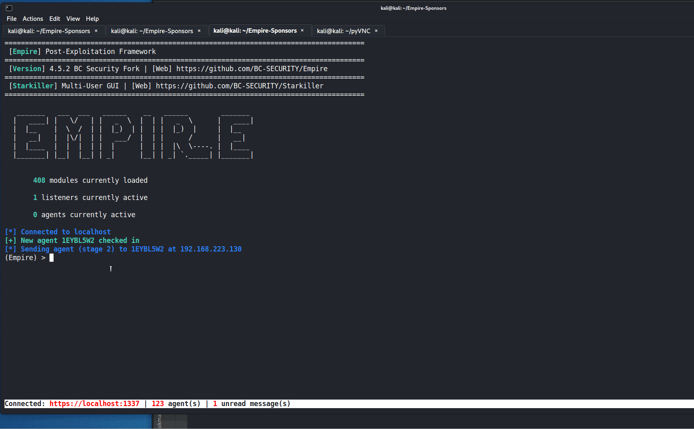

# Interact Menu

Interacting with an agent is how operators manage their implants. Usemodule is accessible from inside an agent and will prepopulate the agent in the options. The interactive shell menu can be accessed by typing `shell`, or you can run a command directly by `shell <command>`. Other options are downloading and uploading files, managing agent comms, and agent configurations.

## **Interactive Shell**

The interactive shell menu opens a shell-like environment for an agent that gives the look/feel of a real shell session. This window includes the current working directory being displayed to the user. All commands will be sent to the agent and returned to the interactive shell window. To run the interactive shell, just type `shell` inside of any agent and to exit the shell session, type `exit` to return to the agent.

## **VNC Client**

Creates a VNC session using the built-in VNC client (based on PyVNC) in the Empire Client. The client requires the address, port, and password to launch.&#x20;

`vnc_client <address> <port> <password>`

## **VNC**

This command creates a VNC server using the C# module, NVNC using a default username and password. That information is then passed to the built-in VNC client to generate a VNC session.

